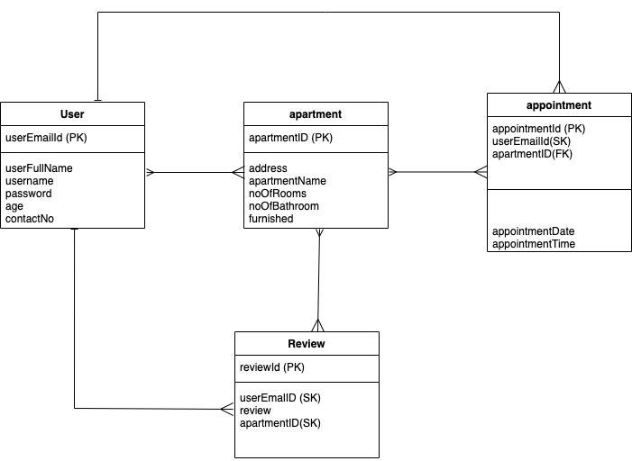
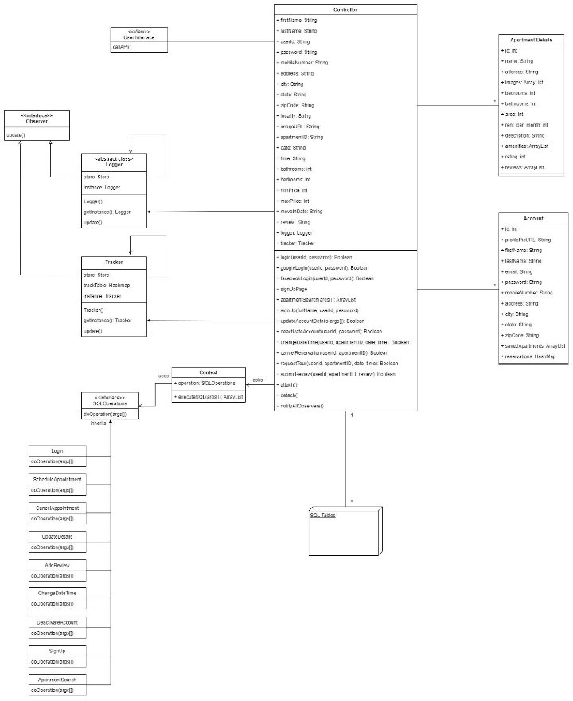
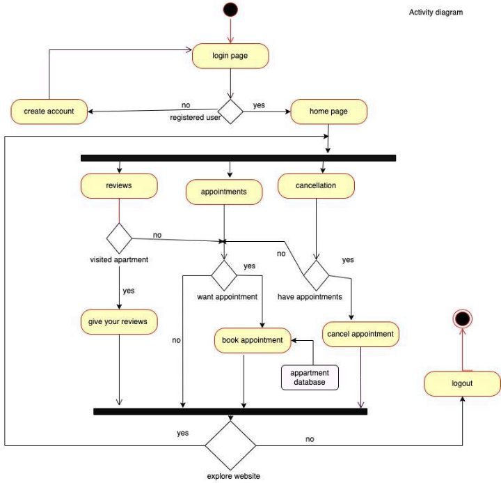
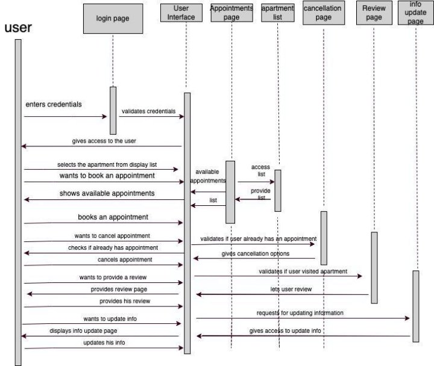

**PROJECT | CSCI 5448 | Object Oriented Analysis and Design**

Divya Sivani Pragadaraju | Mukund Kalantri | Shreyas K

**Project Summary**

The project is called Boulder Apartment Finder. Team members include Divya Sivani Pragadaraju, Mukund Kalantri, and Shreyas K. The aim of the project is to create a website that can find the availability of apartments in Boulder. Taking the idea from popular websites like Zillow, apartmentList, or our own ralphieList, we plan to learn how to design and maintain any website end to end.

When the project is done, a user should be able to create an account, make a reservation to visit an apartment, and leave a review for it. If the user decides not to visit, they will be able to cancel the reservation too.

**Project Requirements**

The big picture of what the project should do is to enable users to see details about the apartments, make a reservation to visit it at a particular time, and then visit to decide on whether they are going to rent it or not. They can also decide not to visit and cancel the visit reservation on the portal. After the visit, the user will also be able to drop a review about the apartment. We also plan to apply sentiment analysis on the reviews to decide a dynamic rating for the apartment. At the end we expect the project should be able to accomplish the following goals.

- Users can create accounts – A UI will be provided to the user to create the account. The details will be saved in the database.
- Users can update their info – When a user logs in, they can view their info. The user will also have the option to update their info.
- Users can book the appointment to visit
- Cancel the booked appointment – The user can cancel the reservation that they had booked.
- User can review the apartment – After the visit, the user will be able to review the apartment.
- Dynamic review rating - The rating of the apartment can be updated based on the reviews.
- Get data of apartments - The application will crawl the websites to generate the data and populate the database.

**Use cases**

<table><tr><th colspan="1" valign="top"><b>ID:</b></td><th colspan="4" valign="top"><b>UC-01</b></td></tr>
<tr><td colspan="1" valign="top"><b>Title:</b></td><td colspan="4" valign="top"><b>Sign up User</b></td></tr>
<tr><td colspan="1" valign="top"><b>Description:</b></td><td colspan="4" valign="top">User can sign up and enter their information in the system.</td></tr>
<tr><td colspan="1" valign="top"><b>Primary Actor:</b></td><td colspan="4" valign="top">User</td></tr>
<tr><td colspan="1" valign="top"><b>Preconditions:</b></td><td colspan="4" valign="top">User is not signed up in the system</td></tr>
<tr><td colspan="1" valign="top"><b>Postconditions:</b></td><td colspan="4" valign="top">User is signed up in the system.</td></tr>
<tr><td colspan="1" rowspan="6" valign="top">
<b>Main</b>

<b>Success Scenario:</b>
</td><td colspan="4"></td></tr>
<tr></td><td colspan="1"></td><td colspan="1" valign="top">Actor Actions</td><td colspan="1" valign="top">System Response</td></tr>
<tr></td><td colspan="1" valign="top">1</td><td colspan="1" valign="top">Select Sign up</td><td colspan="1" valign="top">Show a create new account page</td></tr>
<tr></td><td colspan="1" valign="top">2</td><td colspan="1" valign="top">Enter Details and click sign up</td><td colspan="1" valign="top">Check if all the fields are entered</td></tr>
<tr></td><td colspan="1" valign="top">3</td><td colspan="1" valign="top">User is signed up in the system</td><td colspan="1"></td></tr>
<tr></td><td colspan="4"></td></tr>
<tr><td colspan="1" valign="top"><b>Variations:</b></td><td colspan="4" valign="top">Exceptions – If a user with the same email id already exists, the system notifies the user and asks them to enter the details again.</td></tr>
<tr><td colspan="1" valign="top"><b>Frequency of Use:</b></td><td colspan="4" valign="top">Whenever a user wants to create an account</td></tr>
</table>

<table><tr><th colspan="1" valign="top"><b>ID:</b></td><th colspan="4" valign="top"><b>UC-02</b></td></tr>
<tr><td colspan="1" valign="top"><b>Title:</b></td><td colspan="4" valign="top"><b>Login User</b></td></tr>
<tr><td colspan="1" valign="top"><b>Description:</b></td><td colspan="4" valign="top">User can log in into the system</td></tr>
<tr><td colspan="1" valign="top"><b>Primary Actor:</b></td><td colspan="4" valign="top">User</td></tr>
<tr><td colspan="1" valign="top"><b>Preconditions:</b></td><td colspan="4" valign="top">Actor is signed up in the system</td></tr>
<tr><td colspan="1" valign="top"><b>Postconditions:</b></td><td colspan="4" valign="top">Actor is logged in in the system</td></tr>
<tr><td colspan="1" rowspan="5" valign="top"><b>Main Success Scenario:</b></td><td colspan="4"></td></tr>
<tr></td><td colspan="1"></td><td colspan="1" valign="top">Actor Actions</td><td colspan="1">System Response</td></tr>
<tr></td><td colspan="1" valign="top">1</td><td colspan="1">Enter username and password</td><td colspan="1">Authenticate the user</td></tr>
<tr></td><td colspan="1" valign="top">2</td><td colspan="1" valign="top">User logged in</td><td colspan="1">Display apartment list</td></tr>
<tr></td><td colspan="4"></td></tr>
<tr><td colspan="1" valign="top"><b>Variations:</b></td><td colspan="4" valign="top">
1\. User enters incorrect username and/or password

· System notifies the user. Asks to enter the details again
</td></tr>
<tr><td colspan="1" valign="top"><b>Frequency of Use:</b></td><td colspan="4" valign="top">Whenever a user wants to log in</td></tr>
<tr><td colspan="1" valign="top"><b>ID:</b></td><td colspan="4" valign="top"><b>UC-03</b></td></tr>
<tr><td colspan="1" valign="top"><b>Title:</b></td><td colspan="4" valign="top"><b>Edit user details</b></td></tr>
<tr><td colspan="1" valign="top"><b>Description:</b></td><td colspan="4" valign="top">User can edit their information in the system.</td></tr>
<tr><td colspan="1" valign="top"><b>Primary Actor:</b></td><td colspan="4" valign="top">User</td></tr>
<tr><td colspan="1" valign="top"><b>Preconditions:</b></td><td colspan="4" valign="top">User has their details in the system</td></tr>
<tr><td colspan="1" valign="top"><b>Postconditions:</b></td><td colspan="4" valign="top">User has their updated details in the system</td></tr>
<tr><td colspan="1" rowspan="6" valign="top"><b>Main Success Scenario:</b></td><td colspan="4"></td></tr>
<tr></td><td colspan="1"></td><td colspan="1" valign="top">Actor Actions</td><td colspan="1" valign="top">System Response</td></tr>
<tr></td><td colspan="1" valign="top">1</td><td colspan="1" valign="top">Click a field to edit the details</td><td colspan="1">Blinking cursor comes to the screen</td></tr>
<tr></td><td colspan="1" valign="top">2</td><td colspan="1" valign="top">Update the details and click save</td><td colspan="1">Check if the new value entered is correct.</td></tr>
<tr></td><td colspan="1" valign="top">3</td><td colspan="1">The updated details are shown to the user</td><td colspan="1"></td></tr>
<tr></td><td colspan="4"></td></tr>
<tr><td colspan="1" valign="top"><b>Extensions:</b></td><td colspan="4"></td></tr>
<tr><td colspan="1" valign="top"><b>Frequency of Use:</b></td><td colspan="4" valign="top">Whenever a user wants to edit the details.</td></tr>
<tr><td colspan="1" valign="top"><b>ID:</b></td><td colspan="4" valign="top"><b>UC-04</b></td></tr>
<tr><td colspan="1" valign="top"><b>Title:</b></td><td colspan="4" valign="top"><b>Details of the apartment</b></td></tr>
<tr><td colspan="1" valign="top"><b>Description:</b></td><td colspan="4" valign="top">User clicks on an apartment widget and the screen shows details about the apartment</td></tr>
<tr><td colspan="1" valign="top"><b>Primary Actor:</b></td><td colspan="4" valign="top">User</td></tr>
<tr><td colspan="1" valign="top"><b>Preconditions:</b></td><td colspan="4" valign="top">All the details of the apartment are not visible</td></tr>
<tr><td colspan="1" valign="top"><b>Postconditions:</b></td><td colspan="4" valign="top">All the details of the apartment are visible</td></tr>
<tr><td colspan="1" rowspan="4" valign="top"><b>Main Success Scenario:</b></td><td colspan="4"></td></tr>
<tr></td><td colspan="1"></td><td colspan="1" valign="top">Actor Actions</td><td colspan="1">System Response</td></tr>
<tr></td><td colspan="1" valign="top">1</td><td colspan="1" valign="top">Clicks on the apartment widget</td><td colspan="1">Show a page with all the details of the apartment</td></tr>
<tr></td><td colspan="4"></td></tr>
<tr><td colspan="1" valign="top"><b>Frequency of Use:</b></td><td colspan="4" valign="top">Whenever a user wants to view the apartment details</td></tr>
<tr><td colspan="1" valign="top"><b>ID:</b></td><td colspan="4" valign="top"><b>UC-05</b></td></tr>
<tr><td colspan="1" valign="top"><b>Title:</b></td><td colspan="4" valign="top"><b>Book reservation</b></td></tr>
<tr><td colspan="1" valign="top"><b>Description:</b></td><td colspan="4" valign="top">User can book a reservation to visit the apartment</td></tr>
<tr><td colspan="1" valign="top"><b>Primary Actor:</b></td><td colspan="4" valign="top">User</td></tr>
<tr><td colspan="1" valign="top"><b>Preconditions:</b></td><td colspan="4" valign="top">User does not have an appointment to visit the apartment</td></tr>
<tr><td colspan="1" valign="top"><b>Postconditions:</b></td><td colspan="4" valign="top">User has an appointment to visit the apartment</td></tr>
<tr><td colspan="1" rowspan="6" valign="top"><b>Main Success Scenario:</b></td><td colspan="4"></td></tr>
<tr></td><td colspan="1"></td><td colspan="1" valign="top">Actor Actions</td><td colspan="1" valign="top">System Response</td></tr>
<tr></td><td colspan="1" valign="top">1</td><td colspan="1" valign="top">User clicks on “Book an appointment” button</td><td colspan="1" valign="top">Show a page with available times to visit the apartment</td></tr>
<tr></td><td colspan="1" valign="top">2</td><td colspan="1" valign="top">Enter preferred time and submit</td><td colspan="1" valign="top">Shows response that visit has been booked</td></tr>
<tr></td><td colspan="1" valign="top">3</td><td colspan="1"></td><td colspan="1" valign="top">Sends confirmation email to the user</td></tr>
<tr></td><td colspan="4"></td></tr>
<tr><td colspan="1" valign="top"><b>Extensions:</b></td><td colspan="4" valign="top">Exceptions – If a user tries to book an appointment but some other person has already taken the time slot. Then the user will be prompted to ask for a new time slot.</td></tr>
<tr><td colspan="1" valign="top"><b>Frequency of Use:</b></td><td colspan="4" valign="top">Whenever a user wants to book a reservation.</td></tr>
<tr><td colspan="1" valign="top"><b>ID:</b></td><td colspan="4" valign="top"><b>UC-06</b></td></tr>
<tr><td colspan="1" valign="top"><b>Title:</b></td><td colspan="4" valign="top"><b>Cancel reservation</b></td></tr>
<tr><td colspan="1" valign="top"><b>Description:</b></td><td colspan="4" valign="top">User can cancel a reservation to visit the apartment</td></tr>
<tr><td colspan="1" valign="top"><b>Primary Actor:</b></td><td colspan="4" valign="top">User</td></tr>
<tr><td colspan="1" valign="top"><b>Preconditions:</b></td><td colspan="4" valign="top">User already has an appointment to visit the apartment</td></tr>
<tr><td colspan="1" valign="top"><b>Postconditions:</b></td><td colspan="4" valign="top">User cancels the visit to the apartment</td></tr>
<tr><td colspan="1" rowspan="6" valign="top"><b>Main Success Scenario:</b></td><td colspan="4"></td></tr>
<tr></td><td colspan="1"></td><td colspan="1" valign="top">Actor Actions</td><td colspan="1" valign="top">System Response</td></tr>
<tr></td><td colspan="1" valign="top">1</td><td colspan="1" valign="top">User clicks on “Cancel visit” button</td><td colspan="1">Asks user to reconfirm their decision</td></tr>
<tr></td><td colspan="1" valign="top">2</td><td colspan="1" valign="top">User clicks yes on reconfirm widget</td><td colspan="1">Shows response that visit has been canceled</td></tr>
<tr></td><td colspan="1">3</td><td colspan="1"></td><td colspan="1"></td></tr>
<tr></td><td colspan="4"></td></tr>
<tr><td colspan="1" valign="top"><b>Variations:</b></td><td colspan="4" valign="top">Exceptions – If a user clicks the “No” option on the reconfirmation widget, the visit will not be canceled</td></tr>
<tr><td colspan="1" valign="top"><b>Frequency of Use:</b></td><td colspan="4" valign="top">Whenever a user wants to cancel the visit provided, they already have a visit booked.</td></tr>
<tr><td colspan="1" valign="top"><b>ID:</b></td><td colspan="4" valign="top"><b>UC-07</b></td></tr>
<tr><td colspan="1" valign="top"><b>Title:</b></td><td colspan="4" valign="top"><b>Review apartment</b></td></tr>
<tr><td colspan="1" valign="top"><b>Description:</b></td><td colspan="4" valign="top">User can write a review for the apartment</td></tr>
<tr><td colspan="1" valign="top"><b>Primary Actor:</b></td><td colspan="4" valign="top">User</td></tr>
<tr><td colspan="1" valign="top"><b>Preconditions:</b></td><td colspan="4" valign="top">User should be logged in</td></tr>
<tr><td colspan="1" valign="top"><b>Postconditions:</b></td><td colspan="4" valign="top">User reviews the apartment. The updated aggregated rating is updated</td></tr>
<tr><td colspan="1" rowspan="6" valign="top"><b>Main Success Scenario:</b></td><td colspan="4"></td></tr>
<tr></td><td colspan="1"></td><td colspan="1" valign="top">Actor Actions</td><td colspan="1">System Response</td></tr>
<tr></td><td colspan="1" valign="top">1</td><td colspan="1" valign="top">User clicks on the visited apartment</td><td colspan="1">Show the review box screen</td></tr>
<tr></td><td colspan="1" valign="top">2</td><td colspan="1" valign="top">Reviews the apartment and submit it</td><td colspan="1">
Database is updated with review

Rating is updated for the apartment
</td></tr>
<tr></td><td colspan="1" valign="top">3</td><td colspan="1"></td><td colspan="1"></td></tr>
<tr></td><td colspan="4"></td></tr>
<tr><td colspan="1" valign="top"><b>Variations:</b></td><td colspan="4" valign="top">User has already reviewed the apartment. In this case, the updated review is stored and the rating is updated.</td></tr>
<tr><td colspan="1" valign="top"><b>Frequency of Use:</b></td><td colspan="4" valign="top">Whenever a user wants to review the apartment.</td></tr>
</table>

<table><tr><th colspan="1" valign="top"><b>ID:</b></td><th colspan="5" valign="top"><b>UC-08</b></td></tr>
<tr><td colspan="1" valign="top"><b>Title:</b></td><td colspan="5" valign="top"><b>Delete review</b></td></tr>
<tr><td colspan="1" valign="top"><b>Description:</b></td><td colspan="5" valign="top">a</td></tr>
<tr><td colspan="1" valign="top"><b>Primary Actor:</b></td><td colspan="5" valign="top">User</td></tr>
<tr><td colspan="1" valign="top"><b>Preconditions:</b></td><td colspan="5" valign="top">
User is signed up

User is logged in

User has a review posted
</td></tr>
<tr><td colspan="1" valign="top"><b>Postconditions:</b></td><td colspan="5" valign="top">The review gets deleted and rating gets updated</td></tr>
<tr><td colspan="1" rowspan="6" valign="top"><b>Main Success Scenario:</b></td><td colspan="5"></td></tr>
<tr></td><td colspan="2"></td><td colspan="1">Actor Actions</td><td colspan="1">System Response</td></tr>
<tr></td><td colspan="2" valign="top">1</td><td colspan="1">User clicks on review delete button</td><td colspan="1">Asks user to reconfirm their decision</td></tr>
<tr></td><td colspan="2" valign="top">2</td><td colspan="1">Enter yes on the delete review button</td><td colspan="1">Shows response that visit has been booked</td></tr>
<tr></td><td colspan="2" valign="top">3</td><td colspan="1"></td><td colspan="1">Sends confirmation email to the user</td></tr>
<tr></td><td colspan="1"></td></tr>
<tr><td colspan="1" valign="top"><b>Exceptions:</b></td><td colspan="5" valign="top">If the review does not exist in the data base, notify the user.</td></tr>
<tr><td colspan="1" valign="top"><b>Variations:</b></td><td colspan="5" valign="top">If a user cancels the delete request during confirmation, returns to the review page.</td></tr>
<tr><td colspan="1" valign="top"><b>Frequency of Use:</b></td><td colspan="5" valign="top">Whenever a user wants to delete the review</td></tr>
</table>

**Data Storage**

We plan to use **MySQL** to store the data. To get the data and use it in our java files, we will use the **hibernate** library. The idea is to make a single object of database connection using a singleton pattern. This will be done using the hibernate library. Once done, we will have functions in classes that will get the data from the database and make computations if any.

**Logical Data Model**

**UI Mockups / Sketches**

1. Home Page

2. Sign Up Page

3. Account Details Page

4. Saved Apartments Page

5. Reservations Page

6. Apartment Search Page

7. Apartment Details Page

8. Apartment Review Page

**Class Diagram**

The idea is to use four design patterns - MVC, Singleton, Observer, and Strategy.

**MVC**

For View, we will have a UI screen for the web application from where user will interact. For Model, we will have many SQL tables where the data will be modified as per the user’s actions. The data will also be fetched to be displayed on the the UI. All of these operations would be handled by a Controller.

**Observer**

We are maintaining a logger file while will store all the actions taken on the application per day. We also have a tracker where we will maintain a list of schedules for apartment tour. All of actions taken by any user will generate a notification that would be sent to both of these.

**Singleton**

It is important to have one logger file for each day for all the users and one tracker file throughout the life of this application. To make sure no redundant files are created, we are going to use Singleton.

**Strategy**

We have different actions that would be performed on the SQL Databases. For this, we have a class for each type of action, and what command needs to be executed would be handled by Strategy.

**Activity Diagram**

**Sequence Diagram**

**Architecture Diagram**

